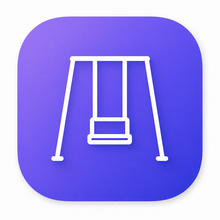

<div align="center">



# vjookh

**Type in the wrong layout? *вжух* — it's fixed.**

An open-source macOS keyboard-layout fixer, in the spirit of the classic
**Punto Switcher**.

[](#building-from-source)
[](#architecture)
[](LICENSE)
[](#privacy)
[](#architecture)

</div>

---

vjookh watches what you type and, when a word was clearly entered in the
wrong layout (e.g. `ghbdtn` instead of `привет`), rewrites it in the correct
layout and switches the system input source. A manual gesture handles the
cases it gets wrong.

Currently supports **English ↔ Russian** — the layout map is JSON-driven and
extensible (see [`Sources/Core/Resources/Layouts/en-ru.json`](Sources/Core/Resources/Layouts/en-ru.json)).

## Privacy

This is, by nature, keystroke-observing software. Its data flow is
deliberately minimal and local:

- 🔒 **In memory only.** The in-progress word lives in a buffer cleared on
  every word boundary, focus change, or navigation key. Nothing typed is ever
  written to disk or logged.
- 📡 **No network code anywhere.** No telemetry, no analytics.
- 💾 **Minimal persisted state.** Only `UserDefaults`: whether the engine is
  enabled, and the per-app exclusion list.

## Usage

- Runs as a **menu-bar agent** — no Dock icon.
- **Auto-correction:** wrong-layout words are fixed as you finish them (Space,
  Tab, Return, or punctuation commits a word). Detection is a dictionary
  cross-check plus a conservative vowel-structure heuristic that catches
  inflected Russian-in-EN-layout words the stems-only wordlist misses.
- **Double-tap ⇧ Shift** to fix the last word manually: if it was
  auto-corrected, that reverts it; if it was left alone, this converts it.
  Repeat to flip back and forth. (Only while the engine is enabled.)
- The **menu-bar item** provides: enable/disable, ignore the current frontmost
  app (per-app exclusion), and launch-at-login.
- On first launch, grant Accessibility when prompted — the engine starts
  automatically once the grant lands; no relaunch needed.

## Permissions

vjookh needs the **Accessibility** permission to observe and synthesize
keystrokes (it uses a `CGEventTap`; the macOS sandbox is incompatible with
this, so the app is **not** sandboxed and cannot ship via the Mac App Store).

On first launch macOS will prompt; grant vjookh in
**System Settings → Privacy & Security → Accessibility**, then relaunch.

## Building from source

Requires Xcode and [XcodeGen](https://github.com/yonaskolb/XcodeGen)
(`brew install xcodegen`).

```sh
# One-time: create a stable local code-signing identity. This keeps the
# Accessibility grant valid across rebuilds (ad-hoc signing does not — its
# code identity changes every build, which silently revokes the grant).
bash scripts/setup-dev-signing.sh

# Generate the Xcode project and build.
xcodegen generate
xcodebuild -project vjookh.xcodeproj -scheme vjookh -configuration Debug build

# Run the pure-logic test suite.
swift test
```

The built `vjookh.app` is under
`~/Library/Developer/Xcode/DerivedData/vjookh-*/Build/Products/Debug/`.

If the app ever starts re-prompting for Accessibility on every rebuild, your
signing identity changed; reset stale grants with:

```sh
tccutil reset Accessibility io.github.vjookh.app
```

## Architecture

| Layer | Responsibility |
|---|---|
| **`Sources/Core`** | Pure, fully unit-tested logic, no system APIs: `LayoutMap` (positional transliteration), `Lexicon` (wordlist membership, reads hunspell `.dic`), `Detector` (wrong-layout decision), `KeystrokeBuffer`, `EventClassifier`, `InputSourceSelector`, `EditPlanner` (correction/undo arithmetic), `ShiftDoubleTapDetector`. |
| **`Sources/System`** | Thin macOS adapters (manually integration-tested): `EventTapController` (CGEventTap; tags synthetic events, recovers from tap auto-disable), `InputSynthesizer`, `InputSourceController` (Carbon TIS), `PermissionsManager`. |
| **`Sources/App`** | `AppDelegate` (menu-bar agent) and `CorrectionPipeline` wiring Core to the adapters. |

Visual identity source art lives in [`Design/`](Design/).

## Licensing

Application code: **GPL-3.0** (see [`LICENSE`](LICENSE)). Bundled dictionaries
retain their upstream licenses — see
[`Sources/Core/Resources/Dictionaries/ATTRIBUTION.md`](Sources/Core/Resources/Dictionaries/ATTRIBUTION.md).
